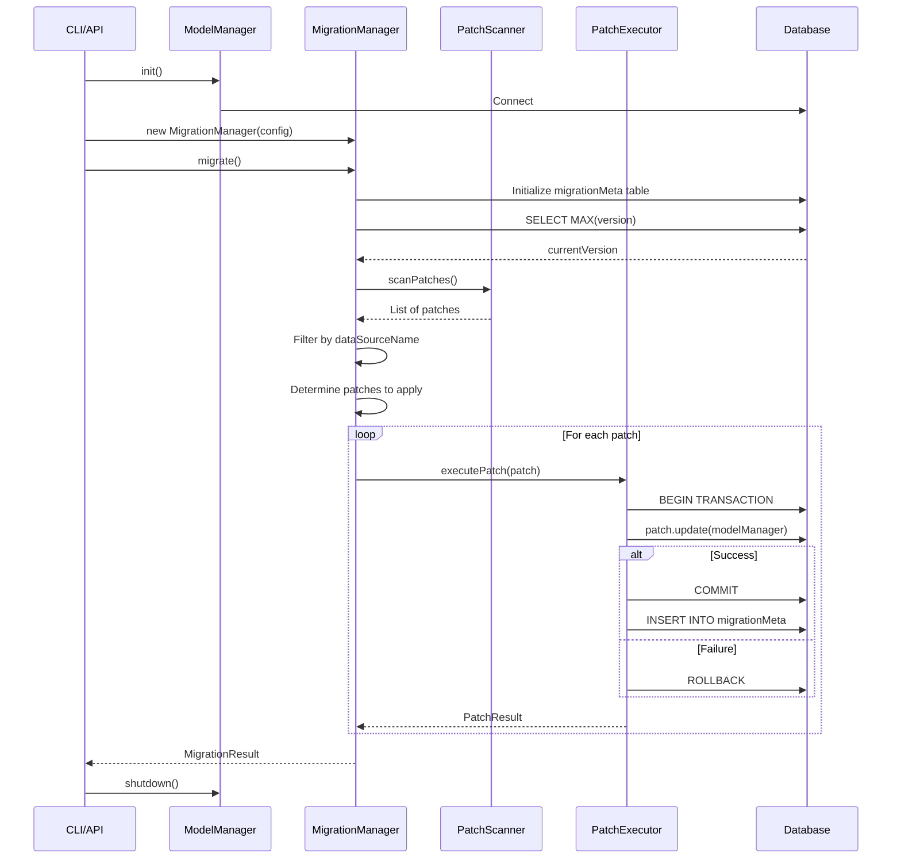

# Execution Flow

## Execution Flow

### Complete Migration Flow



### Patch Execution Detail

```typescript
async executePatch(patch: DatabasePatchInterface): Promise<PatchResult> {
  const startTime = Date.now()
  const dataSource = this.modelManager.getDataSource(patch.dataSourceName)

  // Begin transaction
  await dataSource.beginTransaction()

  try {
    // Log start
    this.logger.info(`Executing: ${patch.version} - ${patch.description}`)

    // Execute patch logic
    await patch.update(this.modelManager)

    // Commit transaction
    await dataSource.commitTransaction()

    // Calculate duration
    const duration = Date.now() - startTime

    // Record in meta table
    await this.metaTable.recordPatch(patch.version, patch.description, duration)

    // Return success
    return {
      version: patch.version,
      description: patch.description,
      status: 'success',
      duration,
    }
  } catch (error) {
    // Rollback transaction
    await dataSource.rollbackTransaction()

    // Return failure (do not record in meta table)
    return {
      version: patch.version,
      description: patch.description,
      status: 'failed',
      duration: Date.now() - startTime,
      error: error as Error,
    }
  }
}
```

## Version Management

### Version Comparison

Versions are compared as strings (lexicographic order):

```typescript
// Chronological order
"2024-02-05_0900" < "2024-02-05_1000" < "2024-02-05_1430";
"2024-02-05_1430" < "2024-02-06_0900";
```

### Determining Patches to Apply

```typescript
function getVersionsToApply(
  allVersions: string[],
  currentVersion: string | null,
  targetVersion: string,
): string[] {
  // Sort all versions chronologically
  const sorted = allVersions.sort();

  // Filter: > currentVersion AND <= targetVersion
  return sorted.filter((v) => {
    const afterCurrent = !currentVersion || v > currentVersion;
    const beforeTarget = v <= targetVersion;
    return afterCurrent && beforeTarget;
  });
}
```

### Example

```
Current version: 2024-02-05_1000
Available patches:
  - 2024-02-05_1000_init-indexes.ts      ❌ Already applied
  - 2024-02-05_1001_subscription-seed.ts ✅ Will apply
  - 2024-02-05_1430_add-roles.ts         ✅ Will apply
  - 2024-02-06_0900_update-schema.ts     ✅ Will apply

Result: [1001, 1430, 0900] will be applied in order
```

## Datasource Resolution

### Static Datasources

For regular datasources (like 'db'):

```typescript
// Configured in application
const modelManager = new ModelManager({
  dataSources: [
    {
      name: "db",
      type: "mysql",
      config: { host, user, password, database },
    },
  ],
});

// Resolved directly
const dataSource = modelManager.getDataSource("db");
```

### Dynamic Datasources

For context-specific databases (like project databases):

```typescript
// Requires context
const context = DataSourceContext.fromDataSources({
  project: { lookupKey: "project-123" },
});

// Resolved dynamically
const dataSource = await modelManager.getDataSourceDynamic(
  "project",
  context.getForDataSource("project"),
);
```

**Use Case:** Migrate individual project databases

```bash
@datacapy/migrate --config ./migrate.config.js \
  --datasource project \
  --context projectId=abc123
```

## Related Documentation

- [Architecture Index](./index.md)
- [System Components](./components.md)
- [Runtime Safety](./runtime-safety.md)
