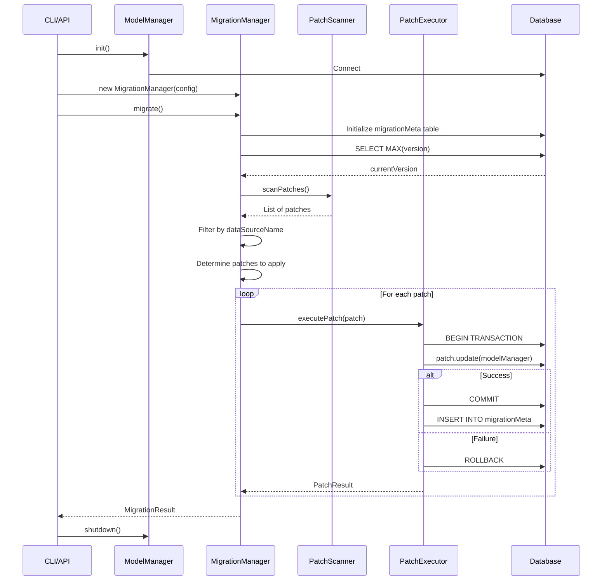

# Migration System Architecture

## Overview

This document explains the technical implementation of the `mzen-migrate` database migration system. For usage instructions, see the [main README](../README.md).

## System Components

### 1. MigrationManager

**Purpose:** Orchestrate migration execution

**Workflow:**

```
1. Initialize
   ├── Resolve target datasource
   └── Initialize migrationMeta table

2. Scan
   ├── Discover patch files in directory
   ├── Filter by dataSourceName
   └── Sort by version chronologically

3. Plan
   ├── Get current version from migrationMeta
   ├── Determine target version
   └── Calculate patches to apply

4. Execute
   ├── For each patch:
   │   ├── Load patch class
   │   ├── Begin transaction
   │   ├── Call update(modelManager)
   │   ├── Commit or rollback
   │   └── Record in migrationMeta
   └── Return summary with counts, duration, errors

5. Report
   └── Return summary with counts, duration, errors
```

**Key Classes:**

- **MigrationManager** - Main orchestrator
- **PatchScanner** - Discovers migration files
- **PatchExecutor** - Executes patches
- **MetaTable** - Tracks applied migrations
- **VersionManager** - Handles version comparison
- **MigrationLogger** - Formatted output

### 2. Migration Patches

**Purpose:** Define individual database changes

**Interface:**

```typescript
interface DatabasePatchInterface {
  version: string; // Unique identifier (e.g., "2024-02-05_1000")
  description: string; // Human-readable description
  dataSourceName: string; // Target datasource ('db', 'project', etc.)
  update(modelManager: ModelManager): Promise<void>; // Migration logic
}
```

**File Structure:**

```
migrate/
└── 2024/                    # Year
    └── 02/                  # Month
        ├── 2024-02-05_1000_init-indexes.ts
        └── 2024-02-05_1001_data-seed.ts
```

**Naming Convention:**

- Format: `YYYY-MM-DD_HHMM_description.ts`
- Version in filename MUST match `version` property
- Chronological ordering by timestamp

### 3. Migration Tracking (migrationMeta Table)

**Purpose:** Track which migrations have been applied

**Schema:**

```javascript
{
  version: '2024-02-05_1430',          // Migration version (primary key)
  description: 'Add users table',      // Description
  appliedAt: new Date('2024-02-05...'), // Timestamp
  duration: 150                        // Execution time (ms)
}
```

**Example Data:**

| version         | description                 | appliedAt           | duration |
| --------------- | --------------------------- | ------------------- | -------- |
| 2024-02-05_1000 | Initialize database indexes | 2024-02-05 10:30:00 | 1245     |
| 2024-02-05_1001 | Seed subscription tiers     | 2024-02-05 10:30:02 | 523      |

## Execution Flow

### Complete Migration Flow



### Patch Execution Detail

```typescript
async executePatch(patch: DatabasePatchInterface): Promise<PatchResult> {
  const startTime = Date.now()
  const dataSource = this.modelManager.getDataSource(patch.dataSourceName)

  // Begin transaction
  await dataSource.beginTransaction()

  try {
    // Log start
    this.logger.info(`Executing: ${patch.version} - ${patch.description}`)

    // Execute patch logic
    await patch.update(this.modelManager)

    // Commit transaction
    await dataSource.commitTransaction()

    // Calculate duration
    const duration = Date.now() - startTime

    // Record in meta table
    await this.metaTable.recordPatch(patch.version, patch.description, duration)

    // Return success
    return {
      version: patch.version,
      description: patch.description,
      status: 'success',
      duration,
    }
  } catch (error) {
    // Rollback transaction
    await dataSource.rollbackTransaction()

    // Return failure (do not record in meta table)
    return {
      version: patch.version,
      description: patch.description,
      status: 'failed',
      duration: Date.now() - startTime,
      error: error as Error,
    }
  }
}
```

## Version Management

### Version Comparison

Versions are compared as strings (lexicographic order):

```typescript
// Chronological order
"2024-02-05_0900" < "2024-02-05_1000" < "2024-02-05_1430";
"2024-02-05_1430" < "2024-02-06_0900";
```

### Determining Patches to Apply

```typescript
function getVersionsToApply(
  allVersions: string[],
  currentVersion: string | null,
  targetVersion: string,
): string[] {
  // Sort all versions chronologically
  const sorted = allVersions.sort();

  // Filter: > currentVersion AND <= targetVersion
  return sorted.filter((v) => {
    const afterCurrent = !currentVersion || v > currentVersion;
    const beforeTarget = v <= targetVersion;
    return afterCurrent && beforeTarget;
  });
}
```

### Example

```
Current version: 2024-02-05_1000
Available patches:
  - 2024-02-05_1000_init-indexes.ts      ❌ Already applied
  - 2024-02-05_1001_subscription-seed.ts ✅ Will apply
  - 2024-02-05_1430_add-roles.ts         ✅ Will apply
  - 2024-02-06_0900_update-schema.ts     ✅ Will apply

Result: [1001, 1430, 0900] will be applied in order
```

## Datasource Resolution

### Static Datasources

For regular datasources (like 'db'):

```typescript
// Configured in application
const modelManager = new ModelManager({
  dataSources: [
    {
      name: "db",
      type: "mysql",
      config: { host, user, password, database },
    },
  ],
});

// Resolved directly
const dataSource = modelManager.getDataSource("db");
```

### Dynamic Datasources

For context-specific databases (like project databases):

```typescript
// Requires context
const context = DataSourceContext.fromDataSources({
  project: { lookupKey: "project123" },
});

// Resolved dynamically
const dataSource = await modelManager.getDataSourceDynamic(
  "project",
  context.getForDataSource("project"),
);
```

**Use Case:** Migrate individual project databases

```bash
mzen-migrate --config ./migrate.config.js \
  --datasource project \
  --context projectId=abc123
```

## Transaction Safety

### Automatic Transactions

Each patch runs in a transaction with automatic rollback on failure:

```typescript
// All operations in this patch are in a transaction
export default class SafeMigration implements DatabasePatchInterface {
  version = "2024-02-09_1000";
  description = "Safe migration with automatic rollback";
  dataSourceName = "db";

  async update(modelManager: ModelManager): Promise<void> {
    const db = modelManager.getDataSource("db");

    // All these operations are in a transaction
    await db.insertOne("users", { email: "user1@example.com" });
    await db.insertOne("users", { email: "user2@example.com" });

    // If this fails, both inserts are rolled back
    await db.createIndex("users", { email: 1 }, { unique: true });
  }
}
```

### Resume Capability

If a migration fails:

1. All changes from the failed patch are rolled back
2. Successfully applied patches remain applied (already committed)
3. Running the migration again resumes from where it stopped

```bash
# First run - patches 1 and 2 succeed, patch 3 fails
$ mzen-migrate --config ./migrate.config.js --datasource db
# ✓ Patch 1 applied and committed
# ✓ Patch 2 applied and committed
# ✗ Patch 3 failed - rolled back, NOT recorded in meta

# Fix the issue in patch 3 and run again
$ mzen-migrate --config ./migrate.config.js --datasource db
# Skipping patch 1 (already in meta table)
# Skipping patch 2 (already in meta table)
# ✓ Patch 3 applied and committed
```

## Dry-Run Mode

### How It Works

```typescript
if (config.dryRun) {
  // 1. Meta table reads execute normally
  // 2. Patches execute normally
  // 3. Transactions are rolled back at the end
  // 4. migrationMeta is NOT updated
}
```

### Implementation

```typescript
async executePatchDryRun(patch: DatabasePatchInterface): Promise<PatchResult> {
  const startTime = Date.now()
  const dataSource = this.modelManager.getDataSource(patch.dataSourceName)

  // Begin transaction
  await dataSource.beginTransaction()

  try {
    // Execute patch logic (writes happen in transaction)
    await patch.update(this.modelManager)

    // ALWAYS rollback in dry-run mode
    await dataSource.rollbackTransaction()

    // Return success (but nothing was actually committed)
    return {
      version: patch.version,
      status: 'success',
      duration: Date.now() - startTime,
    }
  } catch (error) {
    // Rollback transaction
    await dataSource.rollbackTransaction()

    // Return failure
    return {
      version: patch.version,
      status: 'failed',
      duration: Date.now() - startTime,
      error: error as Error,
    }
  }
}
```

**Limitation:** Dry-run may not perfectly predict actual execution since all changes are rolled back.

## Performance Considerations

### Large Datasets

For migrations affecting many records:

```typescript
// ❌ Bad: Load all records into memory
const allUsers = await repo.findAll({});
for (const user of allUsers) {
  await repo.updateOne(
    {
      /* ... */
    },
    { _id: user._id },
  );
}

// ✅ Good: Batch updates
await repo.updateMany({ newField: "value" }, { newField: { $exists: false } });

// ✅ Good: Paginated processing
let skip = 0;
const limit = 1000;
while (true) {
  const batch = await repo.find({}, { skip, limit });
  if (batch.length === 0) break;

  for (const record of batch) {
    await processRecord(record);
  }

  skip += limit;
}
```

### Index Creation

```typescript
// Index creation can be slow on large tables
console.log("Creating indexes (this may take a while)...");
await repo.createIndexes();
```

**Tip:** Schedule migrations during maintenance windows for production.

## Error Handling

### Migration Failure Behaviour

**When a migration fails:**

1. ❌ Patch execution stops
2. ❌ Transaction is rolled back
3. ❌ Error is logged
4. ❌ Migration is NOT recorded in migrationMeta
5. ❌ Subsequent patches are NOT executed (if `stopOnError: true`)
6. ✅ Previous successful patches remain applied

**Recovery:**

```bash
# Fix the issue (code or database)
# Re-run migration - it will pick up where it left off
mzen-migrate --config ./migrate.config.js --datasource db
```

### Custom Error Handling

```typescript
export default class CustomErrorHandling implements DatabasePatchInterface {
  version = "2024-02-10_1000";
  description = "Migration with custom error handling";
  dataSourceName = "db";

  async update(modelManager: ModelManager): Promise<void> {
    const repo = modelManager.getRepo("user");

    try {
      await repo.createIndexes();
    } catch (error) {
      // Handle specific error gracefully
      if (error.message.includes("already exists")) {
        console.log("⚠ Indexes already exist, continuing...");
      } else {
        // Re-throw to trigger rollback
        throw error;
      }
    }
  }
}
```

## Security Considerations

### 1. Never Store Sensitive Data in Migrations

```typescript
// ❌ Bad
await repo.create({
  email: "admin@example.com",
  password: "hardcodedpassword123", // ❌ Never hardcode
});

// ✅ Good
await repo.create({
  email: "admin@example.com",
  password: await hashPassword(process.env.ADMIN_PASSWORD),
});
```

### 2. Validate Input Data

```typescript
// Validate before inserting
const seedData = INITIAL_DATA;
for (const data of seedData) {
  if (!data.code || !data.name) {
    throw new Error("Invalid data");
  }
  await repo.create(data);
}
```

### 3. Backup Before Destructive Operations

```typescript
async update(modelManager: ModelManager): Promise<void> {
  // Always backup before destructive changes
  console.log('⚠ This migration deletes data')
  console.log('⚠ Ensure you have a backup before proceeding')

  // Add safety check
  const isProduction = process.env.NODE_ENV === 'production'
  if (isProduction) {
    throw new Error('Manual confirmation required in production')
  }

  // Destructive operation
  await repo.deleteMany({ status: 'obsolete' })
}
```

## Related Documentation

- [Main README](../README.md) - Usage instructions and examples
- [Best Practices](./best-practices.md) - Guidelines for writing migrations
- [Advanced Usage](./advanced-usage.md) - Advanced patterns and troubleshooting

## Summary

The mzen-migrate system provides:

- ✅ **Controlled** database changes through versioned patches
- ✅ **Tracked** history in migrationMeta table
- ✅ **Safe** execution with transactions and automatic rollback
- ✅ **Flexible** support for static and dynamic datasources
- ✅ **Resumable** automatic resume from last successful patch
- ✅ **Auditable** clear history of all changes
